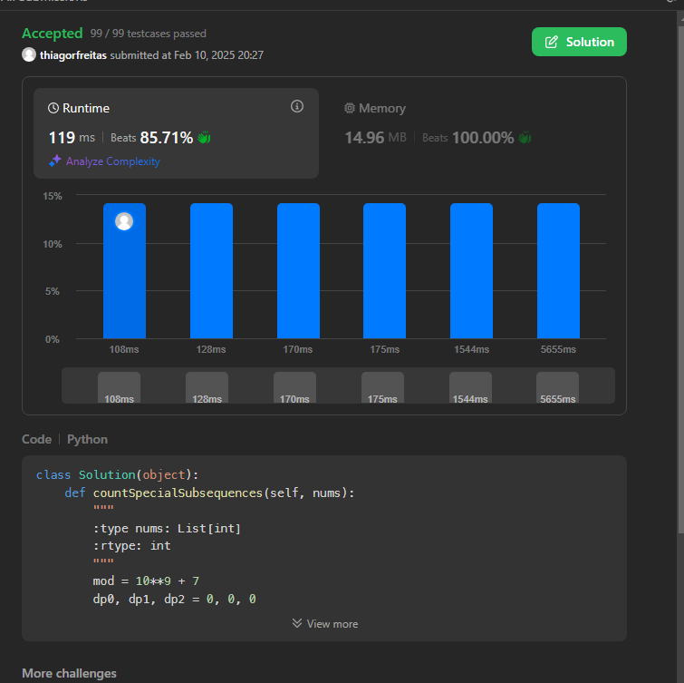
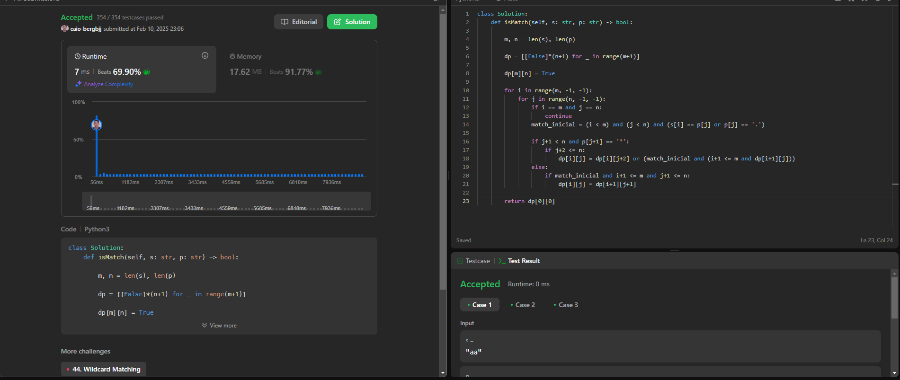

# PD - LeetCode - Dupla 56

**Número da Lista**: 5 
**Conteúdo da Disciplina**: Programação Dinâmica 

## Alunos
|Matrícula | Aluno |
| -- | -- |
| 20/0015753  |  [Caio Berg Carlos Leite](https://github.com/Caio-bergbjj) |
| 20/0028154 |  [Thiago Ribeiro Freitas](https://github.com/thiagorfreitas) |

## Sobre 
Este projeto consiste na resolução de problemas de Programação Dinâmica do LeetCode, para a disciplina de Projeto de Algoritmos, da Universidade de Brasília.

### Problemas

|Problema | Descrição | Dificuldade| Contribuidores
| -- | -- | -- | -- |
| 1955 | [1955 Count Number of Special Subsequences](https://leetcode.com/problems/count-number-of-special-subsequences/?envType=problem-list-v2&envId=dynamic-programming)  | Hard | [Thiago Freitas](https://github.com/thiagorfreitas) |
| 1977 | [1977 Number of Ways to Separate Numbers](https://leetcode.com/problems/number-of-ways-to-separate-numbers/)  | Hard | [Thiago Freitas](https://github.com/thiagorfreitas)
| 10 | [10 Regular Expression Matching](https://leetcode.com/problems/regular-expression-matching/description/)  | Hard | [Caio Berg Carlos Leite](https://github.com/Caio-bergbjj)

## Screenshots

### Count Number of Special Subsequences

Link para Submissão: [1955  Count Number of Special Subsequences - Submissions](https://leetcode.com/problems/count-number-of-special-subsequences/submissions/1538642792)

### Count Number of Special Subsequences

Link para Submissão: [10 Regular Expression Matching](https://leetcode.com/problems/regular-expression-matching/submissions/1538727463)
